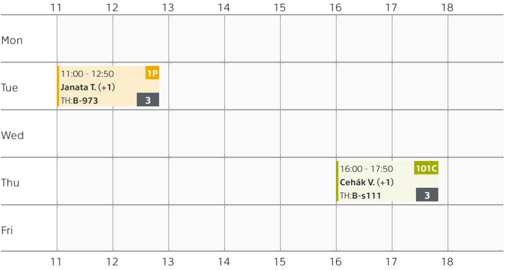

# Cartography {: .page_title}

Cartography has a wide range of applications, especially in combination with other disciplines such as __urban planning__, __demography__ and __statistics__, __environmental sciences__, __economics__, __crisis management__, etc. It is a valuable tool for the effective transfer of spatial information to better understand complex geographical contexts.

This course introduces students to the basics of mathematical, topographic and thematic cartography. It also includes an excursion into polygraphic techniques, theory of colour, copyright and editorial works. The main goal is to teach the students the theory and practical issues of cartographic science, making them able to create a quality thematic, topographical or schematic map, understand the principles of their creation, the correct use of colours, fonts, etc.

__:simple-arcgis: Esri ArcGIS Pro__{: style="white-space: nowrap;"} software is used throughout the course.

<!-- <h2 style="text-align:center;">What will you learn</h2>-->
<!-- styl je zde pridany HTML tagem (ne pomoci '##'), aby se text neobjevil v tabulce obsahu vlevo na strance -->

<!-- 
 <!-- specificky format gridu (trida "grid_icon_info") na miru uvodni strance predmetu -->
<!--
-   :material-map-outline:{ .xl }

    __process__ and __analyze__ spatial (geographic, map) data

-   :material-vector-polygon:{ .xl }

    understand the difference between __vector__ and __raster__ data

-   :material-filter-outline:{ .xl }

    __filter__ data using attribute and spatial queries

-   :material-tools:{ .xl }

    apply basic __spatial functions__ (geoprocessing tools)

-   :material-creation-outline:{ .xl }

    __create__ and __edit__ GIS data

-   :octicons-share-16:{ .xl }

    __share__ data to the web (_ArcGIS Online_ system, web mapping applications)

-   :material-cog-counterclockwise:{ .xl }

    create models for __automated processing__ (_ModelBuilder_)

-->

{: .no-filter }
{: .no-filter }
{: .no-filter }
{: .no-filter }
{: .no-filter }
{: .no-filter }
{: .no-filter }
{: .no-filter }
{: .no-filter }
{: .no-filter }
{: .no-filter }
{: .no-filter }

## Literature

- Brewer, C.A (2005) Designing Better Maps: A Guide for GIS Users. 2nd Edition, Esri Press, Redlands, California.
- Field K. (2018) Cartography: A compendium of design thinking for mapmakers. Esri Press, Redlands, California.
- Field K. (2022) Thematic mapping: 101 inspiring ways to visualise empirical data. Esri Press, Redlands, California.
- Lambert, N. and Zanin, C. (2020). Practical handbook of thematic cartography: Principles, methods, and applications. CRC Press.
- Slocum, T. A., et al. (2008) Thematic Cartography and Geovisualization. 3rd Edition, Prentice Hall.

## Lectures {: style="margin-bottom:0;"}

attendance recommended
{: style="opacity:50%;margin-top:0;"}

{: .off-glb .no-filter style="height: 1.5em; vertical-align: -.4em; clip-path: circle();"} 
[__prof. Ing. Jiří Cajthaml, Ph.D.__](https://geomatics.fsv.cvut.cz/en/employees/jiri-cajthaml/)__&nbsp;__{style="margin-left:1rem;"}{: .off-glb .no-filter style="height: 1.5em; vertical-align: -.4em; clip-path: circle();"} 
[__Ing. Tomáš Janata, Ph.D.__](https://geomatics.fsv.cvut.cz/en/employees/tomas-janata/)

1. Introduction to the course
2. Mathematical cartography
3. Map language, content and composition
4. Methods of terrain visualisation
5. Thematic maps I, colours and scales in maps
6. Thematic maps II
7. History of cartography and state map work
8. Map production process, data sources, INSPIRE, copyright
9. Colour spaces and reproduction

## Practicals {: style="margin-bottom:0;"}

attendance required
{: style="opacity:50%;margin-top:0;"}

{: .off-glb .no-filter style="height: 1.5em; vertical-align: -.4em; clip-path: circle();"} 
[__Mgr. Petra Justová, Ph.D.__](https://geomatics.fsv.cvut.cz/en/employees/petra-justova/)

1. Introduction to ArcGIS, spatial data, data sources
2. Map Projections in Detail
3. Spatial Data, Geocoding
4. Georeferencing, Vectorization
5. Choropleth Maps 1
6. Choropleth Maps 2
7. Diagram Maps
8. Multivariate mapping
9. Grid Maps, Data Binning
10. Webmapping

## Schedule (2025) {: style="margin-bottom:0;"}

[{.off-glb .no-filter style="width: 800px;"}](https://kos.cvut.cz/schedule/course/155CART/semester/B242){target="_blank"}

---

[Course page in :custom-kos-logo-img-BW:{.middle style="margin-left:3px;"} :custom-kos-logo-BW:{.xl .middle}](https://kos.cvut.cz/course-syllabus/155CART/B242 "KOS is the official university administration system"){ .md-button .md-button--primary target="_blank"}
{align=center}

 