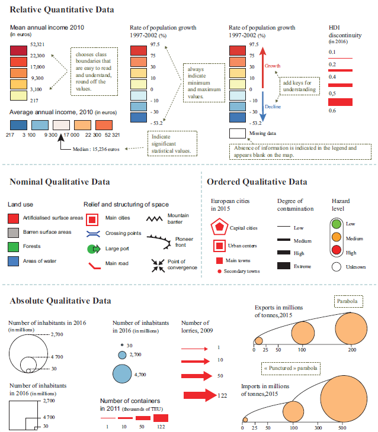
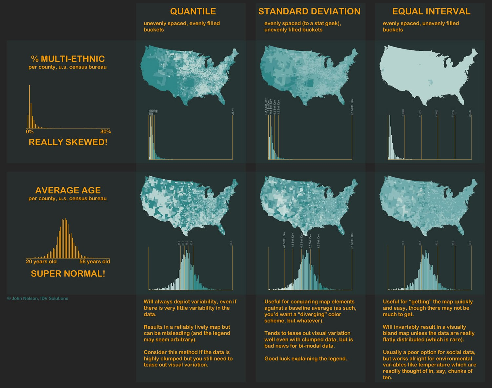
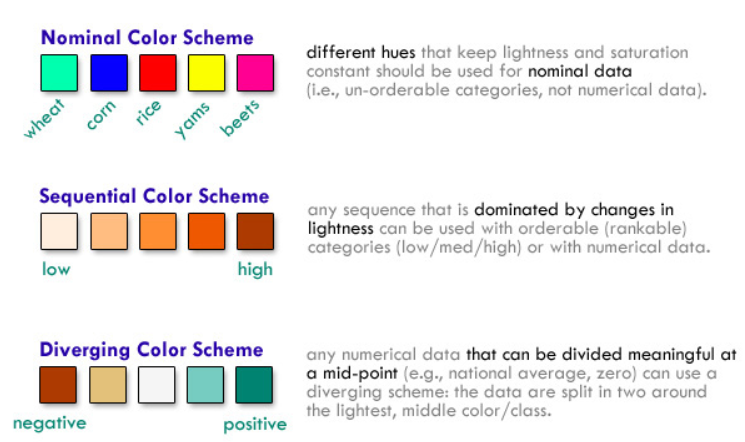
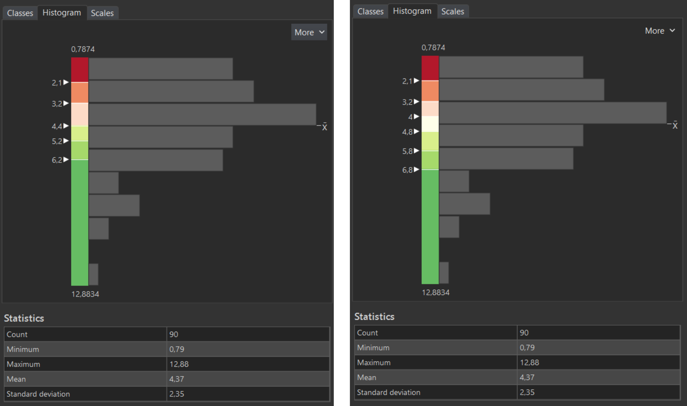

# Choropleth map
A choropleth map is a type of thematic map in which geographic areas are shaded or coloured in proportion to a statistical variable. This technique is widely used in cartography to represent spatial data distributions, such as population density, election results, or economic indicators. Unlike other map types, choropleth maps rely on predefined geographic units (e.g., countries, states, or districts) to visualize data intensity or magnitude.

## Data types
Choropleth maps are used for relative quantitative data and ordered qualitative data.

- **Qualitative Data:** This type of data describes categories or classifications without numerical values. Examples include land use types, political party affiliations, or language distribution.

- **Quantitative Data:** This type of data represents measurable numerical values. Common examples include population density, GDP, or election results.

 
<figure markdown>
  { width=600px }
  <figcaption>Source: Zanin and Lambert (2020)</figcaption>
</figure>

## Data classification
To effectively display data in choropleth maps, classification methods are used to group values into meaningful categories. The most common classification methods include:

- **Equal Interval:** This method divides the range of data into equal-sized intervals. It is useful for data with a uniform distribution but may not work well for skewed datasets.

- **Quantile Classification:** This method assigns an equal number of observations to each class. It is effective when data values are unevenly distributed, ensuring that each category has a similar number of regions.

- **Natural Breaks (Jenks Method):** This method identifies natural groupings in the data by minimizing variance within each class. It is widely used in cartography because it adapts to the dataset’s distribution.

- **Standard Deviation:** This method classifies data based on its deviation from the mean. It is useful for identifying regions with significantly higher or lower values than the average.

 
<figure markdown>
  { width=600px }
  <figcaption>Source: IDV Solutions (2012)</figcaption>
</figure>

 
 

[Normalizing and Classifying Choropleth Maps](https://www.youtube.com/watch?v=nRqdTBKwYeU&ab_channel=ArcGIS){ .md-button .md-button--primary .server_name .external_link_icon_small target="_blank"}
[Telling the Truth with Maps](https://www.youtube.com/watch?v=R1Tfla2DieQ&ab_channel=JohnNelsonMaps){ .md-button .md-button--primary .server_name .external_link_icon_small target="_blank"}
[Telling the Truth](http://uxblog.idvsolutions.com/2011/10/telling-truth.html){ .md-button .md-button--primary .server_name .external_link_icon_small target="_blank"}
[Data Classification in Mapping](https://storymaps.arcgis.com/stories/c52d1948f04d40209fab1605ce3c8ab9){ .md-button .md-button--primary .server_name .external_link_icon_small target="_blank"}
{: .button_array}

## Colour schemes
When statistical data can be classified and hierarchized, it should be transcribed graphically using a visual variable that is able to express order, e.g. colour. Therefore, the choice of color scales is crucial in choropleth maps, as it influences how the data is interpreted. There are two primary types of color scales used:

- **Sequential Color Scales:** These are used for data that progresses from low to high values. They typically involve a gradient from light to dark shades of a single color or closely related hues. For example, a population density map might use light blue for low density and dark blue for high density.

- **Divergent Color Scales:** These are used when data has a meaningful midpoint, such as deviations from an average. They typically use two contrasting colors with a neutral color in the center. For example, an economic growth map might use red for negative growth, white for no change, and blue for positive growth.

 
<figure markdown>
  { width=600px }
  <figcaption>Source: AxisMaps (2020)</figcaption>
</figure>
 

[ColorBrewer](https://colorbrewer2.org/){ .md-button .md-button--primary .server_name .external_link_icon_small target="_blank"}
{: align=center }

## Assignment 04a
!!! abstract "Unemployment Rate in Europe"
    **TASK:**

    Make a series of simple choropleth maps showing the unemployment rate in European countries using two types of colour schemes – sequential (Map 1) and diverging (Map 2).

     
    In technical report describe and compare following classification methods that are available in ArcGIS Pro:
    
    - Equal Interval
    - Quantile
    - Natural Breaks (Jenks)
    - Standard Deviation

    Explain which of them is the best for your map. For each method insert the printscreen of the map.

     
    **DATA SOURCES:**
    
      [:material-download: Eurostat (Unemployment Rate, 2024) :material-layers:](../assets/cviceni5/Europe_UnemploymentRate.csv){ .md-button .md-button--primary .button_smaller }
      [:material-download: GISCO (Countries, 1:20m) :material-layers:](../assets/cviceni5/Europe_CNTR_20M_2024_3035.geojson){ .md-button .md-button--primary .button_smaller .download}
      {: .button_array style="justify-content:flex-start;"}
    
     
    **SUBMISSION FORM:**

    - technical report + 2 maps in PDF format (submit by 30/03, send to <a href="mailto:petra.justova@fsv.cvut.cz">petra.justova@fsv.cvut.cz</a>)
    
    

     
    **INSTRUCTIONS:**
    
    **Map 1:** **Simple Choropleth with Sequential Colour Scheme**
      
      - Add *Europe_CNTR_20M_2024_3035.geojson* to Map
      - Join the table *Europe_UnemploymentRate.csv* to the polygon layer of countries
      - Export the joined table as a new feature class *(Data-Export Features)*
      - Symbolize the layer properly to show the unemployment rate in European countries *(Symbology-Graduated Colors)*. Choose sequential colour scheme.
      - Finish the layout: insert *Map Title*, *Scale*, *Legend* and *Credits*. Add explanation for the abbreviations of the country names used, if any.
      - Export *Layout* in PDF Format

     
    **Map 2:** **Simple Choropleth with Diverging Colour Scheme**
      
      - In *Catalog Pane-Maps* copy and paste the previous Map and rename it
      - In *Symbology* create your own diverging colour scheme for 6 classes *(Colour Scheme-Format Colour Scheme)*. Use appropriate colours to distinguish the values above/below the mean unemployment rate. For inspiration use the *[ColorBrewer tool](https://colorbrewer2.org/)*. Save the colour scheme.
      - Find the mean value of the displayed phenomenon *(More-Show statistics)* and modify class breaks to show 3 classes above the mean value *(high unemployment rate)* and 3 classes below the mean value *(low unemployment rate )*.

        !!! note "Types of divergent Colour Schemes"
            - In a divergent colour scheme, the choice between an even or odd number of intervals affects how the mean value is represented. With an even number of intervals, the mean value serves as a break point between two classes, emphasizing the contrast between values above/below the mean value. In contrast, a divergent colour scheme with an odd number of intervals includes the mean value within the middle class, which is typically represented by a neutral color (e.g. light yellow). This approach highlights the balance point and provides a clear visual distinction between increasing and decreasing values while ensuring that values around the midpoint remains visually distinct.
            
            <figure markdown>
            { width=600px }
            <figcaption>Diverging Colour Schemes in ArcGIS Pro</figcaption>
            </figure>

      - Finish the layout: insert *Map Title*, *Scale*, *Legend* and *Credits*. Add explanation for the abbreviations of the country names used, if any. 
      *(...or you can duplicate the final layout of Map 1...)*
      - Export *Layout* in PDF Format
    