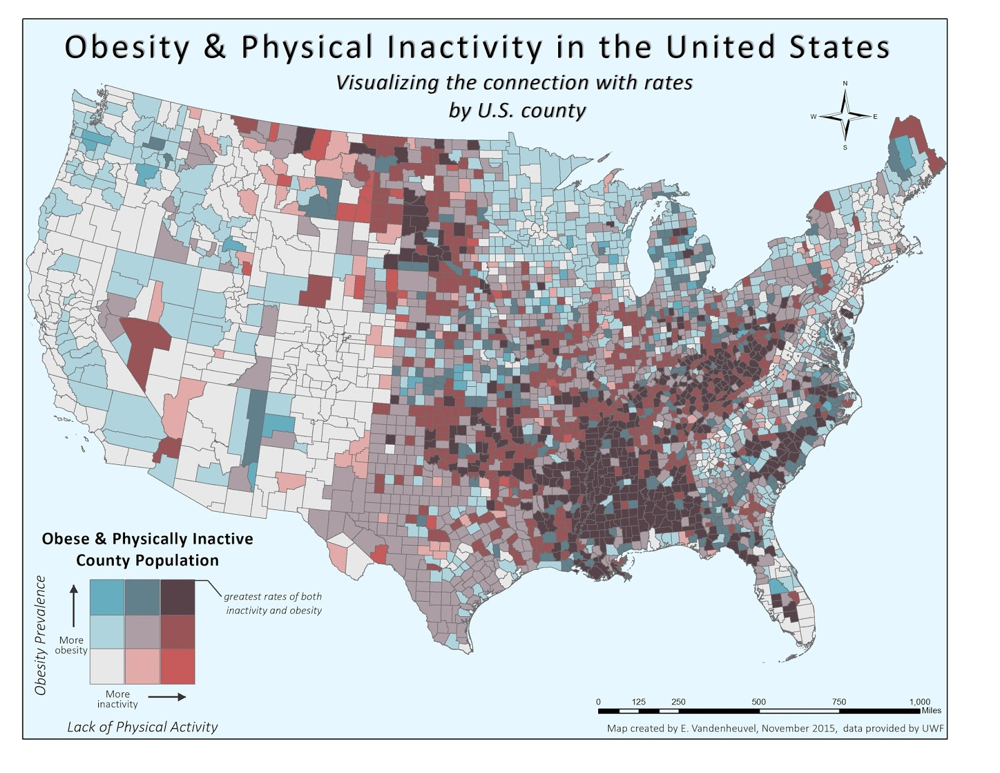
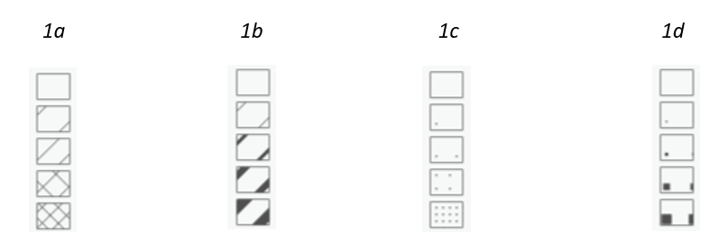

# Bivariate choropleth map
A **bivariate choropleth map** is a thematic map that represents two variables simultaneously within the same geographic units. This type of visualization helps to identify spatial relationships and patterns between the two datasets. There are two basic approaches to design bivariate choropleth maps:

 1. Using a combination of two sequential colour schemes 
 2. Using a combination of hatched fill and coluor
 
 
A bivariate choropleth map allows users to compare two different attributes, visualize their interactions, and analyze their spatial relations.

 
<figure markdown>
  { width=600px }
  <figcaption>Source: Vandenheuvel (2015)</figcaption>
</figure>
<!---[Vandenheuvel (2015)](https://gisnouveau.blogspot.com/2015/11/bivariate-maps-of-choropleth-persuasion.html)-->

 
 

[Bivariate Choropleth Maps in ArcGIS Pro](https://resource.esriuk.com/blog/bivariates-have-never-been-easier-in-arcgis-pro/){ .md-button .md-button--primary .server_name .external_link_icon_small target="_blank"}
{: .button_array}

## Assignment 04b
!!! abstract "Unemployment rate and education in Europe"
    **TASK:**

    Make a series of combined (bivariate) choropleth maps showing the unemployment rate and the proportion of the population with lower education using two types of visualization – a combination of two colors (Map 1) and a combination of hatched fill and color (Map 2).

     
    In technical report answer following questions:
    
    - Compare all possible techniques of hatched fills (striped vs. dotted symbols, symbol spacing vs. symbol size). Which technique is more suitable and why?
    - Compare two types of visualizations (2 colors vs. hatched fill+color) used for combined choropleth map. Which type of visualization is more suitable and why?

     
    **DATA SOURCES:**
    
      [:material-download: Eurostat (Unemployment Rate, 2024) :material-layers:](../assets/cviceni5/Europe_UnemploymentRate.csv){ .md-button .md-button--primary .button_smaller .download}
      [:material-download: Eurostat (Less than primary, primary and lower secondary education, 2023) :material-layers:](../assets/cviceni6/Europe_Education2023.csv){ .md-button .md-button--primary .button_smaller .download}
      [:material-download: GISCO (Countries, 1:20m) :material-layers:](../assets/cviceni5/Europe_CNTR_20M_2024_3035.geojson){ .md-button .md-button--primary .button_smaller .download}
      {: .button_array style="justify-content:flex-start;"}
    

     
    **SUBMISSION FORM:**

    - technical report + 2 maps in PDF format (submit by 06/04, send to <a href="mailto:petra.justova@fsv.cvut.cz">petra.justova@fsv.cvut.cz</a>)
    
    

     
    **INSTRUCTIONS:**
    
    **Map 1:** **Combined Choropleth Map with 2 colours**
      
      - Add *Europe_CNTR_20M_2024_3035.geojson* to Map
      - Join both tables *Europe_UnemploymentRate.csv* *Europe_Education2023* to the polygon layer of countries
      - Export the joined table as a new feature class *(Data-Export Features)*
      - Symbolize the layer properly to show the unemployment rate and the proportion of the population with lower education in European countries *(Symbology-Bivariate Colors)*. Choose sequential colour scheme and customize the legend.
      - Finish the layout: insert *Map Title*, *Scale*, *Legend* and *Credits*. Add explanation for the abbreviations of the country names used, if any.
      - Export *Layout* in PDF Format.

     
    **Map 2:** **Combined Choropleth Map with Hatched Fill and Colour**
      
      - Symbolize the layer showing the unemployment rate as a simple choropleth map with sequential colour scheme (see Assignment 04a)
      - To visualize the proportion of the population with lower education in European countries try out all techniques of hatched fill *(striped vs. dotted symbols, symbol spacing vs. symbol size; see examples in figure below)*
      - Finish the layout: insert *Map Title*, *Scale*, *Legend* and *Credits*. Add explanation for the abbreviations of the country names used, if any.
      - Export *Layout* in PDF Format

      <figure markdown>
        { width=400px }
        <figcaption>Examples of various hatched fill techniques. 1a – striped symbols, symbol spacing; 1b – striped symbols, symbol size; 1c – dotted symbols, symbol spacing; 1d – dotted symbols, symbol size</figcaption>
      </figure>

      
    