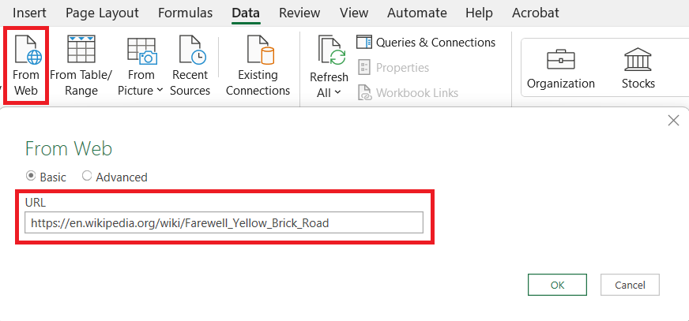
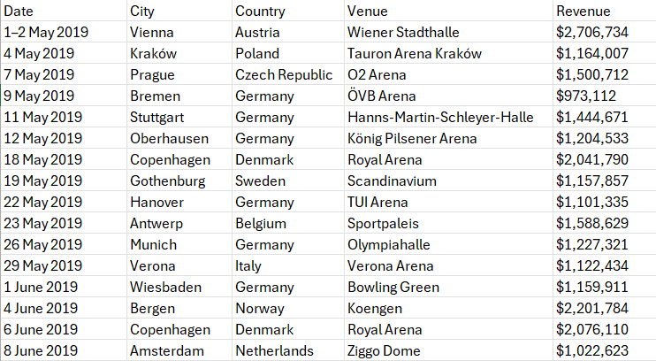

# Geocoding
Finding places on a map is an integral part of a GIS. *Geocoding* is the process of transforming a description of a location (such as a pair of coordinates, an address, or a name of a place) to a location on the earth's surface. You can geocode by providing one location description at a time to zoom to a location on a map or convert an entire table that can be used for spatial analysis. When you *geocode* a table of addresses, you use a locator to create point features that represent the locations of the addresses.

<figure markdown>
{ width=400px }
    <figcaption>Geocoding process [*(ArcMap, 2025)*](https://desktop.arcgis.com/en/arcmap/latest/manage-data/geocoding/geocoding-a-table-of-addresses-about.htm)</figcaption> 
</figure>

__Resources:__
{: align=center }

[pro.arcgis.com Geocoding in ArcGIS Pro](https://pro.arcgis.com/en/pro-app/latest/help/data/geocoding/convert-a-table-to-locations-on-the-map.htm){ .md-button .md-button--primary .server_name .external_link_icon_small target="_blank"}
[pro.arcgis.com Rematch geocoded locations](https://pro.arcgis.com/en/pro-app/latest/help/data/geocoding/rematch-locations-converted-from-a-table.htm){ .md-button .md-button--primary .server_name .external_link_icon_small target="_blank"}
{: .button_array}

???+ note-grey "Geoparsing"

    Geoparsing is a special toponym resolution process of converting free-text descriptions of place names (such as "twenty miles northeast of Paris") into unambiguous geographic identifiers, such as geographic coordinates expressed as latitude-longitude. It is a sofisticated task consisting of two main steps. First one is identifying place names in text (toponym recognition, or named entity recognition for place names). This is the task of identifying place names in text, such as “Paris” or “Aleppo”.
    Second one is resolving place names to their geographic coordinates or entry in a gazetteer of place names (toponym resolution). This main difficulty in this step is handling ambiguous place names: “Aleppo” could refer to the city in Syria, the governorate in Syria, or the township in Pennsylvania.
    
     
    <figure markdown>
    { width=400px }
    <figcaption>Geoparsing process [*(Leppämäki, 2022)*](https://blogs.helsinki.fi/digital-geography/2022/05/16/geoparsing-how-to-gain-location-information-from-finnish-texts/)</figcaption> 
    </figure>

<source src="../assets/cviceni9/Elton.mp4" type="video/mp4">

## Assignment 02
!!! abstract "My favourite artist tour"
    **TASK:**

    Make a map showing the tour of your favourite artist on a selected continent in one year. Your map should display all the locations that the artist visited during the tour and the date of the concert at that location.

     
    **DATA SOURCES:**
    
      [:material-table: artist's tour on Wikipedia](https://en.wikipedia.org/wiki/Farewell_Yellow_Brick_Road){ .md-button .md-button--primary .button_smaller }
      {: .button_array style="justify-content:flex-start;"}
    
    
    **SUBMISSION FORM:**

    - 1 map in PDF format
    
     
    **INSTRUCTIONS:**
    
    **Step 1:** **Data processing**

    - Pick one of your favourite artists and search the Wikipedia for one of his/her tours.  
    *(If you are not into music, you can use [Farewell Yellow Brick Road tour](https://en.wikipedia.org/wiki/Farewell_Yellow_Brick_Road) by Elton John for this task.)*
    - Import data to MS Excel, edit the table and save it in .xlsx format.   
    *(Limit the tour extent to one continent and one year (e.g. Europe in 2019). If there was more than one concert in a city, edit "Date" attribute to show the date range or all dates separately, leave only one record for each city.)*
        
         

        { width=400px }
        { width=400px }
        {: .process_container}

         
    - Import the table to ArcGIS Pro --> use *Excel To Table* tool
    - Right-click the table and select *Geocode Table*. Follow the geocoding guide (do not forget to estimate the credits at the end and run the tool).

         
        <figure markdown>
        { width=200px }
        <figcaption>Geocoding guide in ArcGIS Pro</figcaption> 
        </figure>

    - Check the geocoded feature class. If there are any *unmatched* results or *matched*/*tied* results with low precision, rematch the geocoded addresses.

    ???+ tip "Checking the geocoding results"
        There could be several results for geocoded addresses:
            
        - Matched
        - Tied 
        - Unmatched

             
            <figure markdown>
            { width=600px }
            <figcaption>Geocoding guide in ArcGIS Pro</figcaption> 
            </figure>
        
        After a table of addresses is geocoded, you may find that not all of the addresses or locations in your table were matched to the results you expected; for example, points may not have been created in the location you expected or may lack the precision you were expecting. Inspecting your table may reveal the reason for an unexpected match; for instance, your input may have been missing a city field, or the street name may have been misspelled. For cases such as these, you can review the results, make corrections in your table, and update your geocoding results. You can use the interactive rematch tool in ArcGIS Pro to manually review addresses to make corrections to your original input and geocode again, reposition the location of the matched address, or select a different candidate. You can also modify the locator's settings and geocode the addresses that were matched to unexpected results. This process is called rematching.

 
    **Step 2:** **Data visualization**
    - Use optional symbolization of the layer.
    - In *New Layout* (A3 Portrait) insert the Map Title, Scale and Credits
    - Label each location (Name+Date).
    - Export *Layout* in PDF Format

    **1.** In *Map Properties* set appropriate Reference scale.

    **2.** Find appropriate symbols to represent the points and use suitable basemap. If there are available some supplemental attributes like attendance or revenue, you can use advanced symbology like proportional symbols or graduated colors.

    **3.** Label features (you can use either name, date, or expression consisting of name and state code for example)

    **4.** Optionaly, you can you *Points to Lines* to connect the tour locations.

    **3.** Insert the A3 format layout (choose landscape or portrait orientation).

    **4.** Finish the layout: insert map window, add title, subtitle, legend, and credits. Feel free to make it nice! You can see an inspiration for your output below.

    { .no-filter .off-glb }
    {: align=center}