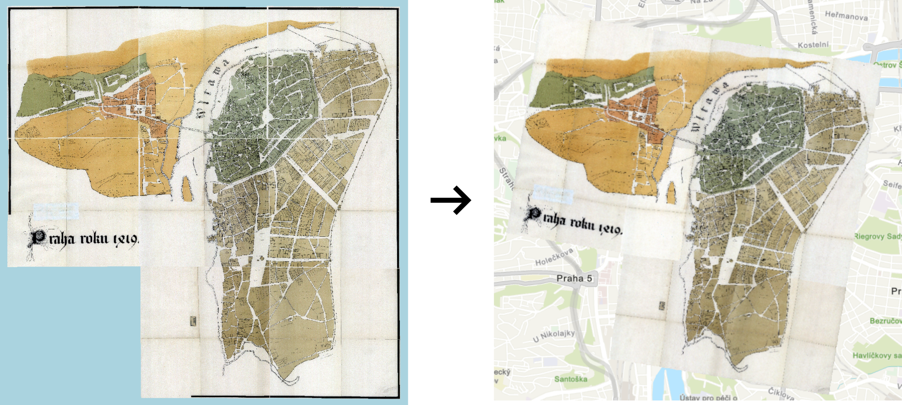
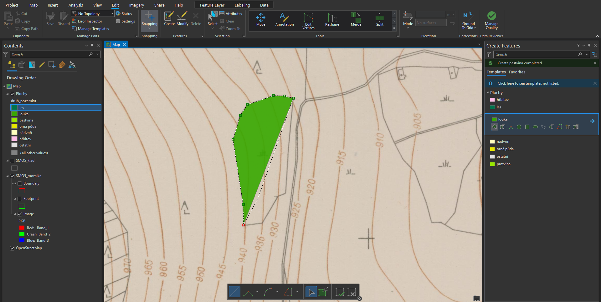
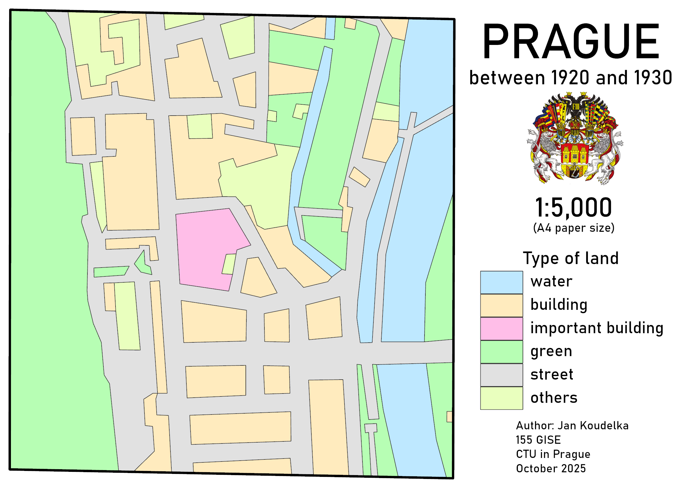
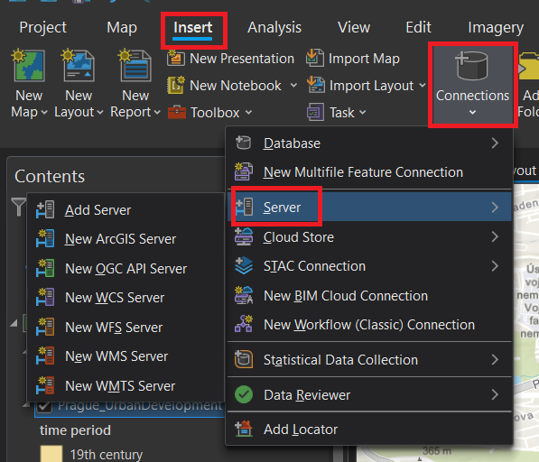
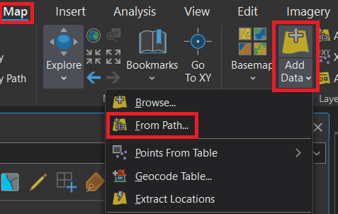
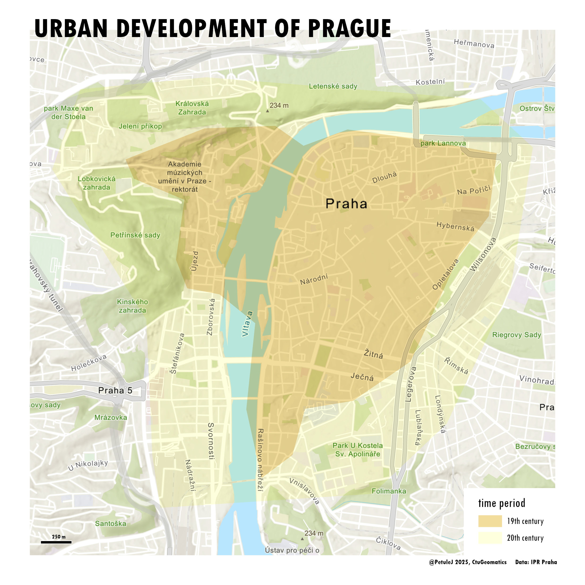

# Georeferencing, Editing and Creating Vector Data

## Georeferencing
Raster data is obtained from many sources, such as satellite images, aerial cameras, and scanned maps. Unlike modern satellite images and aerial cameras that tend to have relatively accurate location information and might need only slight adjustments to line up all your GIS data, scanned maps and historical data usually do not contain any spatial reference information. In these cases you need to use the process of georeferencing. 

Georeferencing is the process of assigning real-world geographic coordinates to a raster image or a scanned map, enabling it to be accurately placed within a spatial reference system. This process involves matching identifiable points on the image with corresponding locations on a reference dataset, such as a satellite image or a vector map. For control points you should select features that are stable and easy to identify in both datasets such as churches, bridges, road intersections, river confluences, or long-standing public buildings. The points should be spread across the whole map sheet rather than concentrated in one corner.

Georeferencing is essential in cartography and GIS, as it allows historical maps, aerial photographs, or other spatial data to be integrated with other GIS layers for analysis, visualization, and decision-making.

<figure markdown>
  { width=600px }
  <figcaption>Georeferencing an old map</figcaption>
</figure>

__Sources:__
{: align=center }

[pro.arcgis.com Overview of georeferencing](https://pro.arcgis.com/en/pro-app/latest/help/data/imagery/overview-of-georeferencing.htm){ .md-button .md-button--primary .server_name .external_link_icon_small target="_blank"}
[pro.arcgis.com Understanding Raster Georeferencing](https://www.esri.com/about/newsroom/arcuser/understanding-raster-georeferencing/){ .md-button .md-button--primary .server_name .external_link_icon_small target="_blank"}
[pro.arcgis.com Georeferencing tools](https://pro.arcgis.com/en/pro-app/latest/help/data/imagery/georeferencing-tools.htm){ .md-button .md-button--primary .server_name .external_link_icon_small target="_blank"}
[Brad Skopyk Georeferencing Historical Maps](https://storymaps.arcgis.com/stories/dd75d0398f7d4ded924d303161895b8b){ .md-button .md-button--primary .server_name .external_link_icon_small target="_blank"}
[learn.arcgis.com/ Georeference historical imagery in ArcGIS Pro](https://learn.arcgis.com/en/projects/georeference-imagery-in-arcgis-pro/){ .md-button .md-button--primary .server_name .external_link_icon_small target="_blank"}
{: .button_array}

## Vectorization

For analysing raster maps, it is almost always necessary to vectorise them, i.e., convert the map into vector data. There are various ways to automate this process, but here we will demonstrate the simplest method: manual vectorisation.

**1.** Vector data editing tools are located in the *:material-tab: Edit*{: .outlined_code} tab. 

**2.** New elements are created by clicking the *:material-button-cursor: Create*{: .outlined_code} and then selecting a drawing tool for the desired subtype in the *:material-tab: Create Features*{: .outlined_code} pane.

**3.** Vectorized points are added with the left mouse button. To complete the vectorization of a particular element, either double-click with the left mouse button or select the icon *:material-button-cursor: Finish*{: .outlined_code} in the tools at the bottom of the screen. When vectorising, make sure snapping [_:material-button-cursor: Snapping_{: .outlined_code}](https://pro.arcgis.com/en/pro-app/latest/help/editing/enable-snapping.htm) is enabled.

**4.** After editing vector data, do not forget to save your edits by clicking *:material-button-cursor: Save*{: .outlined_code} in *:material-tab: Edit*{: .outlined_code} tab.

<figure markdown>

    <figcaption>Vectorization of a raster map</figcaption>
</figure>

__Sources:__
{: align=center }

[pro.arcgis.com Editing in ArcGIS Pro](https://pro.arcgis.com/en/pro-app/latest/help/editing/overview-of-desktop-editing.htm){ .md-button .md-button--primary .server_name .external_link_icon_small target="_blank"}
[John Nelson Draw Detailed Polygons in ArcGIS Pro, Fast and Easy](https://youtu.be/Ab9aqsHj8X8?si=C4CCfrIkuYrrwDoK){ .md-button .md-button--primary .server_name .external_link_icon_small target="_blank"}
[learn.arcgis.com Copy features between layers](https://learn.arcgis.com/en/projects/copy-features-between-layers/){ .md-button .md-button--primary .server_name .external_link_icon_small target="_blank"}
[pro.arcgis.com Introduction to subtypes](https://pro.arcgis.com/en/pro-app/latest/help/data/geodatabases/overview/an-overview-of-subtypes.htm){ .md-button .md-button--primary .server_name .external_link_icon_small target="_blank"}
[University of Redlands ArcGIS Pro Tutorial: Georeferencing and Digitizing A Historic Map of the "Oklahoma Indian Territory”](https://www.youtube.com/watch?v=QWv5nwCeZjA){ .md-button .md-button--primary .server_name .external_link_icon_small target="_blank"}
[ArcGIS Blog Digitizing scanned maps using AI in ArcGIS Pro](https://www.esri.com/arcgis-blog/products/arcgis-pro/mapping/digitizing-scanned-maps-using-ai-in-arcgis-pro){ .md-button .md-button--primary .server_name .external_link_icon_small target="_blank"}
{: .button_array}

## Checking vector topology

If you want to check the topological integrity of vector data, all layers you want to validate must be stored within a single dataset.

**1.** To create a new topology, right-click the dataset → *:material-form-dropdown: New*{: .outlined_code} → *:material-form-dropdown: Topology*{: .outlined_code}.

**2.** On the first page of the *:material-tab: Create Topology Wizard*{: .outlined_code}, define the topology parameters: its name, cluster tolerance/precision, and input layers.

**3.** The second page contains definitions of the topology rules to be checked. Set these as needed. In this example, we will check the rules *:material-magnify: Must Not Have Gaps (Area)*{: .outlined_code} (the data must not contain gaps), *:material-magnify: Must Not Overlap With (Area-Area)*{: .outlined_code} (layers must not overlap one another), and *:material-magnify: Must Not Overlap (Area)*{: .outlined_code} (features within a layer must not overlap themselves).

**4.** The third page provides a summary of the topology. Click *:material-button-cursor: Finish*{: .outlined_code} to create it.

**5.** If the topology does not appear in the output dataset, refresh its contents by right-clicking → *:material-form-dropdown: Refresh*{: .outlined_code}.

**6.** Next, you need to validate the topology by right-clicking the topology in the *:material-tab: Catalog*{: .outlined_code} pane → *:material-button-cursor: Validate*{: .outlined_code}.

**7.** After validation, drag the topology layer into the map view—you should see any detected errors.

**8.** Use the *:material-button-cursor: Edit*{: .outlined_code} tools to fix the highlighted errors in the original data. After editing, validate the topology again. If no errors are found, the checked layers are topologically correct.

???+ note " Tips for speeding up topology checks:"
    - If possible, for data with the same attribute (e.g., forest, meadow) you can run [*:material-cog: __Dissolve__*{: .outlined_code}](https://pro.arcgis.com/en/pro-app/latest/tool-reference/data-management/dissolve.htm). This merges features and can remove self-overlap issues within the same category (for example, two meadow polygons overlapping each other).
    - To simplify topology checking, you can merge all checked data into a single layer and then validate that layer on its own. This way, you do not need to check overlaps between different layers using :material-magnify: Must Not Overlap With{: .outlined_code}; instead, you only check the new layer against itself using :material-magnify: Must Not Overlap{: .outlined_code}. However, after checking, do not forget to fix any errors in the original data.

__Sources:__
{: align=center }

[pro.arcgis.com What is topology](https://pro.arcgis.com/en/pro-app/latest/help/data/topologies/an-overview-of-topology-in-arcgis.htm){ .md-button .md-button--primary .server_name .external_link_icon_small target="_blank"}
[pro.arcgis.com Schematic overview of topology rules](https://pro.arcgis.com/en/pro-app/latest/help/editing/pdf/topology_rules_poster.pdf){ .md-button .md-button--primary .server_name .external_link_icon_small target="_blank"}
{: .button_array}

## Assignment 03
!!! abstract "Vectorization of an old map"
    **TASK:**

    Create a simple map reconstructing part of Prague in the early 20th century. In the map, distinguish at least four types of features: water bodies, green areas, built-up areas, and public spaces/streets. The map must include labels for at least one feature from each category, with label styling adapted to the feature type.

     
    **DATA SOURCES:**
    
      [:material-map: Plan of Prague (1920–1930)](../assets/cviceni4/Prague_Plan_1920-1930_detail.jpg){ .md-button .md-button--primary .button_smaller target="_blank"}
      {: .button_array style="justify-content:flex-start;"}

    - Where can I find more old maps?

    [OldMapsOnline](https://www.oldmapsonline.org/){ .md-button .md-button--primary .server_name .external_link_icon_small target="_blank"}
    [David Rumsey Map Collection](https://www.davidrumsey.com/){ .md-button .md-button--primary .server_name .external_link_icon_small target="_blank"}
    {: .button_array}
    
     
    **SUBMISSION FORM:**

    - 1 map in PDF format (submit by 29/03, send to <a href="mailto:petra.justova@fsv.cvut.cz">petra.justova@fsv.cvut.cz</a>)

    
    

     
    **INSTRUCTIONS:**
    
    **Step 1:** **Georeference the map**

    - Create new project in ArcGIS Pro (save to disk :H).
    - Add the old map to your *Map project* (_add data_).
    - Find the added map (_zoom to layer_).
    - Activate the *Georeference* tool (*Imagery* tab -> _Georeference_).
    - On the *Georeference* tab, click *Add Control Points*. Now try to find at least 4 identical points (control points) on the image *(source)* and the reference map *(target)*. These points should be spread out throughout the image to obtain the best possible registration (For example churches, old bridges, islands, towers...).
    - After collecting all points, on the *Georeference* tab, click *Save* and _Close georeference_.

    **Step 2:** **Create new data**

    - Create new dataset _(Catalog-Geodatabase-New-Dataset)_.
    - Create new feature class *(Catalog-Geodatabase-New-Feature Class)*. Create two polygon layers: (1) The first layer, named “extent”, will define the boundary of the area of interest. The second layer, named “LandUse”,  will contain the vectorised polygons representing land use types.
    - Create subtypes for “LandUse” layer _(Attribut table-Table-Add-Subtypes-Create)_. Define following subtypes: _Important building_,  _Building_, _Public space/Street_, _Green area_, _Water body_ and _Other_.
    - Set the symbology of “LandUse” layer by subtype _(Save-Symbology-Unique values)_ and assign colours.
    - Vectorize the boundary of the area of interest into “extent” layer. 
    - Vectorize all types of land use in your study area into a “LandUse” layer using simple editing tools.
    - Merge the same subtypes into one element _(Tools-Dissolve)_.
    - Do not forget to check the topology. Fix any errors if necessary.
    - Create a new annotation layer. In this layer, define four annotation classes that use different font styles and colours to distinguish labels for the four basic land-use categories, for example: buildings (bold, black/dark grey), public spaces/streets (regular, black/dark grey), green areas (regular, dark green), and water bodies (italic, dark blue).
    - Label at least one feature from each category.

    **Step 3:** **Create a layout**

    - Create new Layout (A4 Landscape).
    - Title.
    - Map frame (in scale 1:5,000).
    - Information about scale.
    - Information about author.
    - Legend - add with _(Add legend-Convert to graphics-Ungroup)_ and edit.
    - Try to add some labels to important places.
    - Export *Layout* in PDF Format, DPI 120.

    

<figure markdown>
  { width=800px }
  <figcaption>Example of the final output.</figcaption>
</figure>

<!--
## Assignment 03
!!! abstract "Urban development of the city"
    **TASK:**

    Make a map showing the urban development of chosen city (your hometown, the capital of your country, ...). Derived the extent of built-up areas from old maps (try to show at least three time periods including this year). Try to quantify the change (in relative and absolute numbers).

     
    In technical report answer following questions:
    
    - How has the extent of built-up area changed during the whole time period (relatively and absolutely)?

     
    **DATA SOURCES:**
    
      [:material-map: Plan of Prague (1920–1930)](../assets/cviceni4/Prague_Plan_1920-1930_detail.jpg){ .md-button .md-button--primary .button_smaller target="_blank"}
      {: .button_array style="justify-content:flex-start;"}
    
     
    **SUBMISSION FORM:**

    - technical report + 1 map in PDF format (submit by 23/03, send to <a href="mailto:petra.justova@fsv.cvut.cz">petra.justova@fsv.cvut.cz</a>)
    
    

     
    **INSTRUCTIONS:**
    
    **Step 1:** **Find a map**
    
    - Search the browser or digital map collections to find the old map of your chosen city  
    *(If you find an already georeferenced map that is provided as a [WMS/WMTS]("A Web Map Service (WMS) or Web Map Tile Service (WMTS) are standard protocols for serving geospatial data as images (e.g., PNG, JPEG) over the web. It allows clients to request maps and map layers from a server and display them on a map viewer or client application."), connect it to ArcGIS Pro __(1)__{title="How to add WMS/WMTS service to ArcGIS Pro"}. and proceed to step 3)*

    [OldMapsOnline](https://www.oldmapsonline.org/){ .md-button .md-button--primary .server_name .external_link_icon_small target="_blank"}
    [David Rumsey Map Collection](https://www.davidrumsey.com/){ .md-button .md-button--primary .server_name .external_link_icon_small target="_blank"}
    {: .button_array}

    - If you want to use another (older) plan of Prague, you can use [:material-map: Jüttner's plan of Prague (1816)](https://geoportalpraha.cz/en/data-and-services/5374334f2c8c446996a174cef7351310){ .md-button .md-button--primary .button_smaller }
     
    *(Jüttner's plan of Prague (1816) is already georeferenced and provided via [ArcGIS REST service]("ArcGIS REST Service is a web service (such as WMS or WMTS) that allows users to access and interact with geographic data and GIS functionalities over the internet using RESTful APIs. It enables querying, visualization, and analysis of spatial data from ArcGIS Server in applications and web maps."), just copy the URL and add the map to ArcGIS Pro __(2)__{title="How to add data from path"}, and proceed to step 3)*
        
     
    **Step 2:** **Georeference the map**

    - Add the old map to your *Map project*.
    - Set the projection of *Map* properly (Properties-Coordinate Systems)
    - Activate the *Georeference* tool (*Imagery* tab).
    - Zoom in to the area of interest (area covered by the old map). Save the map display to *Bookmarks* (*Map* tab).
    - On the *Georeference* tab choose *Fit to Display* to reposition and place the image within the current map display. You can use *Move/Scale/Rotate* tool to refine the approximate placement of the image for better identification of control points for georeferencing in next step.
    - On the *Georeference* tab, click *Add Control Points*. Now try to find at least 4 identical points (control points) on the image *(source)* and the reference map *(target)*. These points should be spread out throughout the image to obtain the best possible registration.
    - After collecting all points, on the *Georeference* tab, click *Save*.

         
    **Step 3:** **Vectorization**

    - Create new feature class *(Catalog-Databases-New-Feature Class)*. Choose the feature geometry, add fields for attributes you want to record *(“year”)* and choose the right coordinate system.
    - Vectorize the extent of built-up area for all georeferenced maps (*Edit-Features-Create Feature*). For each polygon, i.e. an old map, enter the value for *“year”* attribute.
    - Symbolize the layer properly to show the urban expansion of your city *(Symbology-Graduated Colors)*. Overlay the layers on a reference map that reflects the current extent of built-up area *(Map-Layer-Basemap)*.
    - Finish the layout: insert *Map Title*, *Scale*, *Legend* and *Credits*. Feel free to make it nice! You can see an inspiration for your output below.  
    - Export *Layout* in PDF Format

    

    1.  { .no-filter width=700px} Add WMS/WMTS service to ArcGIS Pro
    2.  { .no-filter width=700px} Add data from path to ArcGIS Pro

     
    { width=600px }
    {: align=center}

-->

    

    