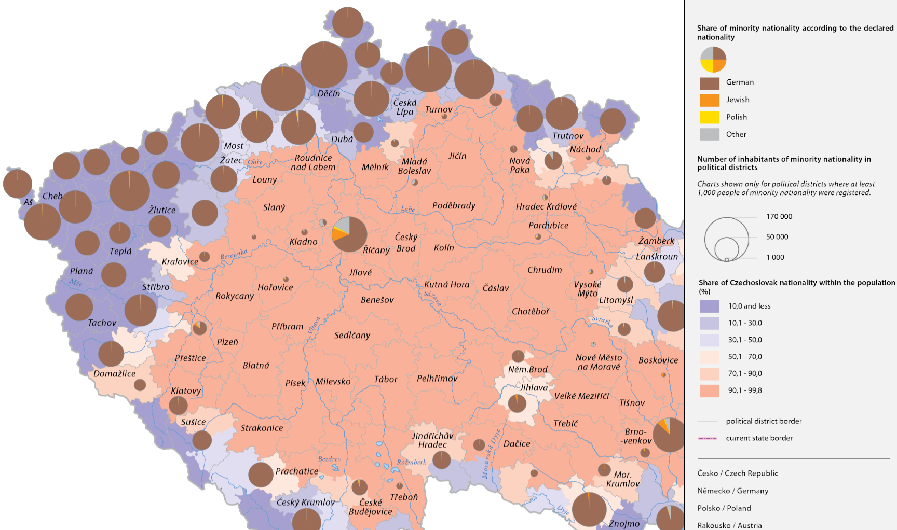
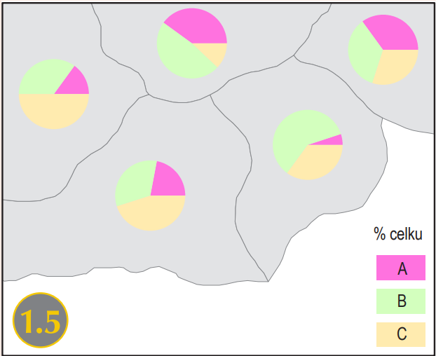
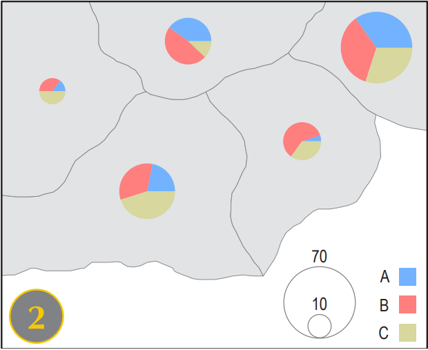

# Proportional Symbol map
A **proportional symbol map** is a type of thematic map that uses symbols, usually circles or squares, to represent quantitative data at specific geographic locations. The size of each symbol is directly proportional to the value it represents—for example, a city with a larger population will have a larger circle than a city with a smaller population.

This mapping technique is particularly useful when illustrating totals or absolute values, such as population numbers, production volumes, or the number of events. Proportional symbol maps can be either true proportional (exact scale to the data values) or range-graded, where data is grouped into categories with a fixed set of symbol sizes.

Because the symbols can overlap in densely populated areas, careful design and placement are essential to maintain readability. These maps are effective for comparing values across locations while preserving geographic accuracy.

<figure markdown>
  { width=800px }
  <figcaption>Proportional symbol map showing the ethnic structure of the Czech Lands in 1935 (Source: Czech historical atlas (2021))</figcaption>
</figure>

 
 

[Proportional Symbol Maps in ArcGIS Pro](https://pro.arcgis.com/en/pro-app/latest/help/mapping/layer-properties/proportional-symbology.htm){ .md-button .md-button--primary .server_name .external_link_icon_small target="_blank"}
{: .button_array}

## Assignment 05
!!! abstract "Population age structure in Europe"
    **TASK:**

    Make a series of proportional symbol maps:
    
    - Map 1 will show the age index and population composition

    <figure markdown>
        { width=250px }
      </figure>

    
    - Map 2 will show the age index, population composition and total population

        <figure markdown>
        { width=250px }
      </figure>

     
    **DATA SOURCES:**
    
      [:material-download: Eurostat (Age structure, 2024) :material-layers:](../assets/cviceni7/Europe_AgeStructure.csv){ .md-button .md-button--primary .button_smaller .download}
      [:material-download: GISCO (Countries, 1:20m) :material-layers:](../assets/cviceni5/Europe_CNTR_20M_2024_3035.geojson){ .md-button .md-button--primary .button_smaller .download}
      {: .button_array style="justify-content:flex-start;"}
    

     
    **SUBMISSION FORM:**

    - 2 maps in PDF format (submit by 18/05, send to <a href="mailto:petra.justova@fsv.cvut.cz">petra.justova@fsv.cvut.cz</a>)
    
    

     
    **INSTRUCTIONS:**
    
    **Map 1:** **Age index and population composition**
      
      - Add *Europe_CNTR_20M_2024_3035.geojson* to Map
      - Join *Europe_AgeStructure.csv* to the polygon layer of countries
      - Export the joined table as a new feature class *(Data-Export Features)*
      -	Export the new polygon layer to point layer using *Feature To Point* tool (name it *Europe_AgeStructure_point* or similar)
      - Symbolize the polygon layer properly to show the [age index]("The age index expresses how many people aged 65 and over per 100 children aged 0–14 in a given population.") *(Symbology-Graduated Colors)*. Select sequential colour scheme and customize the legend.
      - Symbolize the point layer properly to show the age structure  *(Symbology-Charts-Pie Chart)*. Set appropriate qualitative colour scheme and parameters of the chart (*Size type-Fixed size*)
      - Finish the layout: insert *Map Title*, *Scale*, *Legend* and *Credits*. Add explanation for the abbreviations of the country names used, if any.
      - Export *Layout* in PDF Format.

     
    **Map 2:** **Age index, population composition and total population**
      
      - Duplicate the previous *Map*
      - Keep the polygon layer displaying the age index.
      - Change the symbology of the point layer properly to show the age structure and total population *(Symbology-Charts-Pie Chart)*. Set appropriate qualitative colour scheme and parameters of the chart (*Size type-Field-TotalPop_2024*)
      - Finish the layout: insert *Map Title*, *Scale*, *Legend* and *Credits*. Add explanation for the abbreviations of the country names used, if any.
      - Export *Layout* in PDF Format

      
    